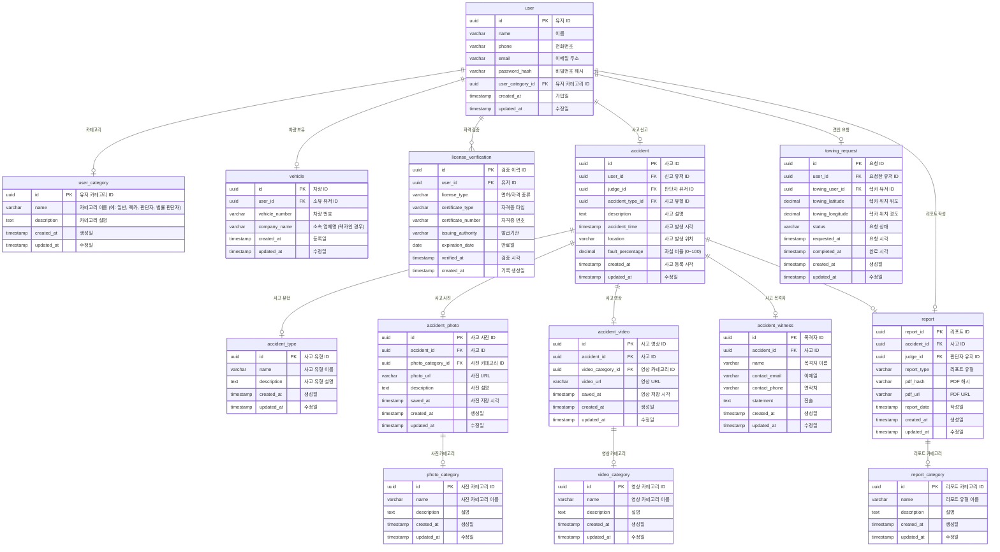

```mermaid
erDiagram
    user {
        uuid id PK "유저 ID"
        varchar name "이름"
        varchar phone "전화번호"
        varchar email "이메일 주소"
        varchar password_hash "비밀번호 해시"
        uuid user_category_id FK "유저 카테고리 ID"
        timestamp created_at "가입일"
        timestamp updated_at "수정일"
    }

    user_category {
        uuid id PK "유저 카테고리 ID"
        varchar name "카테고리 이름 (예: 일반, 렉카, 판단자, 법률 판단자)"
        text description "카테고리 설명"
        timestamp created_at "생성일"
        timestamp updated_at "수정일"
    }

    vehicle {
        uuid id PK "차량 ID"
        uuid user_id FK "소유 유저 ID"
        varchar vehicle_number "차량 번호"
        varchar company_name "소속 업체명 (렉카인 경우)"
        timestamp created_at "등록일"
        timestamp updated_at "수정일"
    }

    license_verification {
        uuid id PK "검증 이력 ID"
        uuid user_id FK "유저 ID"
        varchar license_type "면허/자격 종류"
        varchar certificate_type "자격증 타입"
        varchar certificate_number "자격증 번호"
        varchar issuing_authority "발급기관"
        date expiration_date "만료일"
        timestamp verified_at "검증 시각"
        timestamp created_at "기록 생성일"
    }

    accident {
        uuid id PK "사고 ID"
        uuid user_id FK "신고 유저 ID"
        uuid judge_id FK "판단자 유저 ID"
        uuid accident_type_id FK "사고 유형 ID"
        text description "사고 설명"
        timestamp accident_time "사고 발생 시각"
        varchar location "사고 발생 위치"
        decimal fault_percentage "과실 비율 (0~100)"
        timestamp created_at "사고 등록 시각"
        timestamp updated_at "수정일"
    }

    towing_request {
        uuid id PK "요청 ID"
        uuid user_id FK "요청한 유저 ID"
        uuid towing_user_id FK "렉카 유저 ID"
        decimal towing_latitude "렉카 위치 위도"
        decimal towing_longitude "렉카 위치 경도"
        varchar status "요청 상태"
        timestamp requested_at "요청 시각"
        timestamp completed_at "완료 시각"
        timestamp created_at "생성일"
        timestamp updated_at "수정일"
    }

    accident_type {
        uuid id PK "사고 유형 ID"
        varchar name "사고 유형 이름"
        text description "사고 유형 설명"
        timestamp created_at "생성일"
        timestamp updated_at "수정일"
    }

    accident_photo {
        uuid id PK "사고 사진 ID"
        uuid accident_id FK "사고 ID"
        uuid photo_category_id FK "사진 카테고리 ID"
        varchar photo_url "사진 URL"
        text description "사진 설명"
        timestamp saved_at "사진 저장 시각"
        timestamp created_at "생성일"
        timestamp updated_at "수정일"
    }

    photo_category {
        uuid id PK "사진 카테고리 ID"
        varchar name "사진 카테고리 이름"
        text description "설명"
        timestamp created_at "생성일"
        timestamp updated_at "수정일"
    }

    accident_video {
        uuid id PK "사고 영상 ID"
        uuid accident_id FK "사고 ID"
        uuid video_category_id FK "영상 카테고리 ID"
        varchar video_url "영상 URL"
        timestamp saved_at "영상 저장 시각"
        timestamp created_at "생성일"
        timestamp updated_at "수정일"
    }

    video_category {
        uuid id PK "영상 카테고리 ID"
        varchar name "영상 카테고리 이름"
        text description "설명"
        timestamp created_at "생성일"
        timestamp updated_at "수정일"
    }

    accident_witness {
        uuid id PK "목격자 ID"
        uuid accident_id FK "사고 ID"
        varchar name "목격자 이름"
        varchar contact_email "이메일"
        varchar contact_phone "연락처"
        text statement "진술"
        timestamp created_at "생성일"
        timestamp updated_at "수정일"
    }

    report {
        uuid report_id PK "리포트 ID"
        uuid accident_id FK "사고 ID"
        uuid judge_id FK "판단자 유저 ID"
        varchar report_type "리포트 유형"
        varchar pdf_hash "PDF 해시"
        varchar pdf_url "PDF URL"
        timestamp report_date "작성일"
        timestamp created_at "생성일"
        timestamp updated_at "수정일"
    }

    report_category {
        uuid id PK "리포트 카테고리 ID"
        varchar name "리포트 유형 이름"
        text description "설명"
        timestamp created_at "생성일"
        timestamp updated_at "수정일"
    }

    %% 관계 정의
    user ||--o| user_category : "카테고리"
    user ||--o| vehicle : "차량 보유"
    user ||--o{ license_verification : "자격 검증"
    user ||--o| accident : "사고 신고"
    user ||--o| towing_request : "견인 요청"
    user ||--o| report : "리포트 작성"
    accident ||--o| accident_type : "사고 유형"
    accident ||--o| accident_photo : "사고 사진"
    accident ||--o| accident_video : "사고 영상"
    accident ||--o| accident_witness : "사고 목격자"
    accident ||--o| report : "사고 리포트"
    accident_photo ||--o| photo_category : "사진 카테고리"
    accident_video ||--o| video_category : "영상 카테고리"
    report ||--o| report_category : "리포트 카테고리"


```