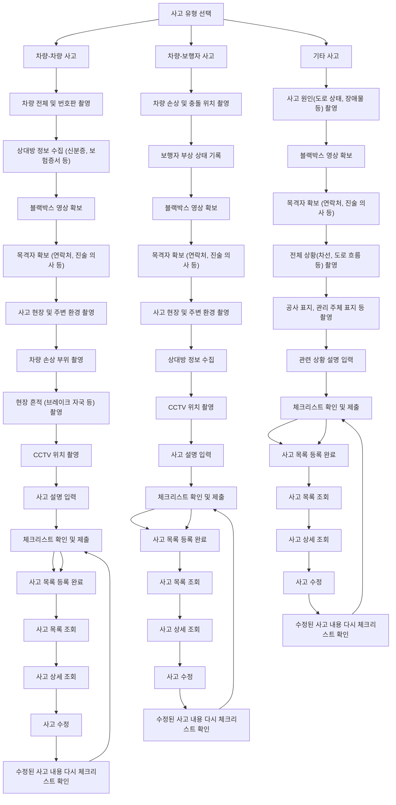

```mermaid
graph TD
    A["사고 유형 선택"] --> B1["차량-차량 사고"]
    A --> B2["차량-보행자 사고"]
    A --> B3["기타 사고"]

    %% 차량-차량 사고
    B1 --> C1["차량 전체 및 번호판 촬영"]
    C1 --> D1["상대방 정보 수집 (신분증, 보험증서 등)"]
    D1 --> E1["블랙박스 영상 확보"]
    E1 --> F1["목격자 확보 (연락처, 진술 의사 등)"]
    F1 --> G1["사고 현장 및 주변 환경 촬영"]
    G1 --> H1["차량 손상 부위 촬영"]
    H1 --> I1["현장 흔적 (브레이크 자국 등) 촬영"]
    I1 --> J1["CCTV 위치 촬영"]
    J1 --> K1["사고 설명 입력"]
    K1 --> Z1["체크리스트 확인 및 제출"]
    Z1 --> L1["사고 목록 등록 완료"]

    %% 차량-보행자 사고
    B2 --> C2["차량 손상 및 충돌 위치 촬영"]
    C2 --> D2["보행자 부상 상태 기록"]
    D2 --> E2["블랙박스 영상 확보"]
    E2 --> F2["목격자 확보 (연락처, 진술 의사 등)"]
    F2 --> G2["사고 현장 및 주변 환경 촬영"]
    G2 --> H2["상대방 정보 수집"]
    H2 --> I2["CCTV 위치 촬영"]
    I2 --> J2["사고 설명 입력"]
    J2 --> Z2["체크리스트 확인 및 제출"]
    Z2 --> L2["사고 목록 등록 완료"]

    %% 기타 사고
    B3 --> C3["사고 원인(도로 상태, 장애물 등) 촬영"]
    C3 --> D3["블랙박스 영상 확보"]
    D3 --> E3["목격자 확보 (연락처, 진술 의사 등)"]
    E3 --> F3["전체 상황(차선, 도로 흐름 등) 촬영"]
    F3 --> G3["공사 표지, 관리 주체 표지 등 촬영"]
    G3 --> H3["관련 상황 설명 입력"]
    H3 --> Z3["체크리스트 확인 및 제출"]
    Z3 --> L3["사고 목록 등록 완료"]

    %% 사고 목록에서 상세 조회 및 수정
    L1 --> M1["사고 목록 조회"]
    L2 --> M2["사고 목록 조회"]
    L3 --> M3["사고 목록 조회"]

    %% 사고 상세 조회 후 수정
    M1 --> N1["사고 상세 조회"]
    M2 --> N2["사고 상세 조회"]
    M3 --> N3["사고 상세 조회"]

    N1 --> O1["사고 수정"]
    N2 --> O2["사고 수정"]
    N3 --> O3["사고 수정"]

    O1 --> P1["수정된 사고 내용 다시 체크리스트 확인"]
    O2 --> P2["수정된 사고 내용 다시 체크리스트 확인"]
    O3 --> P3["수정된 사고 내용 다시 체크리스트 확인"]

    P1 --> Z1["체크리스트 확인 및 제출"]
    P2 --> Z2["체크리스트 확인 및 제출"]
    P3 --> Z3["체크리스트 확인 및 제출"]

    %% 사고 목록으로 돌아가기
    Z1 --> L1
    Z2 --> L2
    Z3 --> L3

```