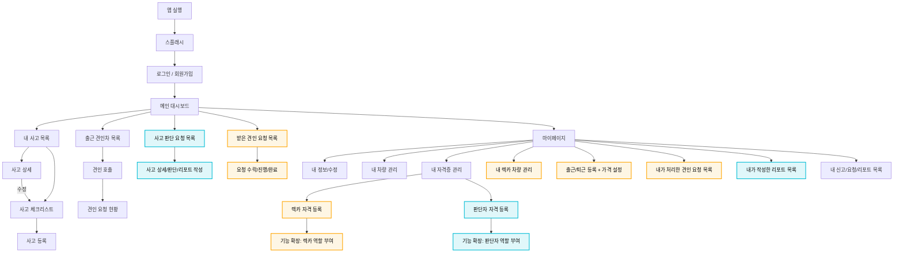

```mermaid
flowchart TD

%% 기본 앱 흐름
A[앱 실행] --> B[스플래시]
B --> C[로그인 / 회원가입]
C --> D[메인 대시보드]

%% 메인 대시보드
D --> D2[내 사고 목록]
D --> D3[출근 견인차 목록] --> D3a[견인 호출] --> D3b[견인 요청 현황]
D --> D4[사고 판단 요청 목록] --> D4a[사고 상세/판단/리포트 작성]
D --> D5[받은 견인 요청 목록] --> D5a[요청 수락/진행/완료]
D --> E[마이페이지]

%% 내 사고 목록 갈래
D2 --> D2a[사고 상세]
D2 --> D2b[사고 체크리스트] --> D2c[사고 등록]

%% 사고 상세 → 체크리스트 (수정)
D2a -->|수정| D2b

%% 마이페이지
E --> E1[내 정보/수정]
E --> E2[내 차량 관리]
E --> E3[내 자격증 관리] --> F1[렉카 자격 등록] --> F1a[기능 확장: 렉카 역할 부여]
E3 --> F2[판단자 자격 등록] --> F2a[기능 확장: 판단자 역할 부여]

E --> E4[내 렉카 차량 관리]
E --> E5[출근/퇴근 등록 + 가격 설정]
E --> E6[내가 처리한 견인 요청 목록]
E --> E7[내가 작성한 리포트 목록]
E --> E8[내 신고/요청/리포트 목록]

%% 역할에 따른 클래스 설정
class D4,D4a,F2,F2a,E7 판단자;
class D5,D5a,F1,F1a,E4,E5,E6 렉카;

%% 스타일 정의
classDef 렉카 fill:#fef6e4,stroke:#ffa500,stroke-width:2px,color:#000;
classDef 판단자 fill:#e0f7fa,stroke:#00bcd4,stroke-width:2px,color:#000;

```
