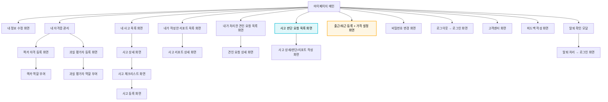

```mermaid
flowchart TD

%% 마이페이지 메인
A[마이페이지 메인] --> B[내 정보 수정 화면]
A --> C[내 자격증 관리]

%% 역할 확장
C --> C1[렉카 자격 등록 화면] --> C1a[렉카 역할 부여]
C --> C2[과실 평가자 등록 화면] --> C2a[과실 평가자 역할 부여]

%% 활동 요약
A --> D[내 사고 목록 화면]
D --> D1[사고 상세 화면]
D1 --> D2[사고 체크리스트 화면]
D2 --> D3[사고 등록 화면]

A --> E[내가 작성한 리포트 목록 화면]
E --> E1[사고 리포트 상세 화면]

A --> F[내가 처리한 견인 요청 목록 화면]
F --> F1[견인 요청 상세 화면]

%% 역할별 기능
A --> G[사고 판단 요청 목록 화면]:::과실
G --> G1[사고 상세/판단/리포트 작성 화면]

A --> H[출근/퇴근 등록 + 가격 설정 화면]:::렉카

%% 공통 메뉴
A --> I[비밀번호 변경 화면]
A --> J[로그아웃 → 로그인 화면]
A --> K[고객센터 화면]
A --> L[피드백 작성 화면]
A --> M[탈퇴 확인 모달] --> M1[탈퇴 처리 → 로그인 화면]

%% 스타일 정의
classDef 렉카 fill:#fef6e4,stroke:#ffa500,stroke-width:2px,color:#000;
classDef 과실 fill:#e0f7fa,stroke:#00bcd4,stroke-width:2px,color:#000;

```