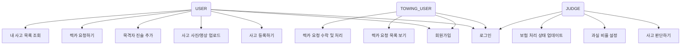

```mermaid
%% 유스 케이스 다이어그램
%% 액터: 일반 사용자, 렉카 기사, 판단자

%%{ init : { "theme" : "default" } }%%
graph TD

    %% 액터 정의
    사용자(USER)
    렉카기사(TOWING_USER)
    판단자(JUDGE)

    %% 공통 유스케이스
    signup[회원가입]
    login[로그인]

    %% 유스케이스 노드 정의
    accident[사고 등록하기]
    photo[사고 사진/영상 업로드]
    witness[목격자 진술 추가]
    towingRequest[렉카 요청하기]
    viewAccidents[내 사고 목록 조회]

    viewRequests[렉카 요청 목록 보기]
    handleRequest[렉카 요청 수락 및 처리]

    judgeAccident[사고 판단하기]
    setFault[과실 비율 설정]
    updateInsurance[보험 처리 상태 업데이트]

    %% 액터와 유스케이스 연결
    사용자 --> signup
    사용자 --> login
    사용자 --> accident
    사용자 --> photo
    사용자 --> witness
    사용자 --> towingRequest
    사용자 --> viewAccidents

    렉카기사 --> signup
    렉카기사 --> login
    렉카기사 --> viewRequests
    렉카기사 --> handleRequest

    판단자 --> login
    판단자 --> judgeAccident
    판단자 --> setFault
    판단자 --> updateInsurance

```
